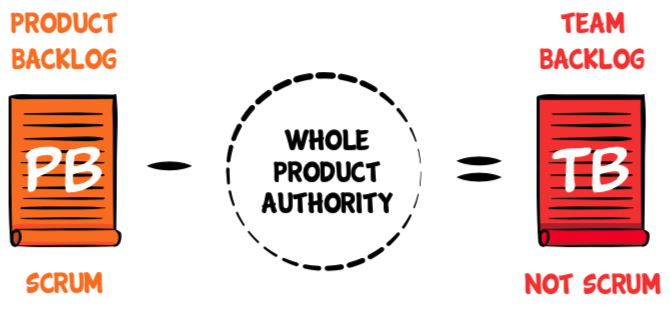
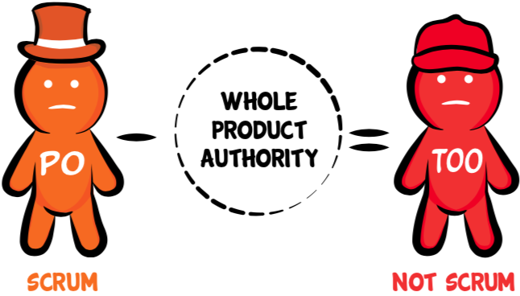

Small teams are great, and mandated by the definition of Scrum.  Scrum also mandates a Product Backlog and Product Owner.  

Most companies have more than 11 people working on any given product.  *Just to make Scrum fit* (a [local optimization](/local-optimization-bias)), they will redefine "Product" to mean something narrower than the whole product.  This is the first step into an Orwellian world where words mean the opposite of their original intent.

The next mistake is to give each team a "Product Backlog" which astute observers will notice is really only a *Team Backlog*.

And then give each team a separate "Product Owner" who is really just a *Team Output Owner*.

This leaves us with perhaps a dozen separate "Scrum Teams" who managers worry would run around like chickens with their heads cut off unless we pulled them together somehow.  The traditional way of doing this, dating back at least as far as Julius Caesar's army, is to add hierarchical layers.  Humans have trouble thinking of alternatives to hierarchical layers; unfortunately this is what's recommended at the end of Henrik Kniberg's extremely popular Product Owner video (a great video up until the few minutes at the end).  So now we get "Chief Product Owner" or "Business Owner" or some other way of filling the gap.  

A decendent of the failed Rational Unified Process (RUP) approach called Scale Agile Framework (SAFe) adds a multi-layer stack of traditional management on top of our "Scrum Teams."  It sells really well because it's really just [renaming all the traditional roles to Agile-sounding roles](https://fansofless.com).  

These traditional/Agile hybrid approaches leave the biggest problems in the traditional space rather than the Scrum space of single-list prioritization and team self organization.  With a narrow view of the product, only our toes wind up being Agile.

[Read more about Whole Product Focus](https://less.works/less/principles/whole-product-focus.html)
